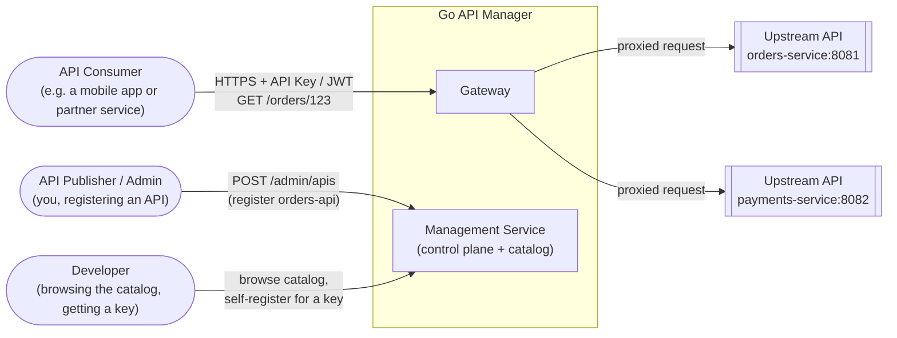
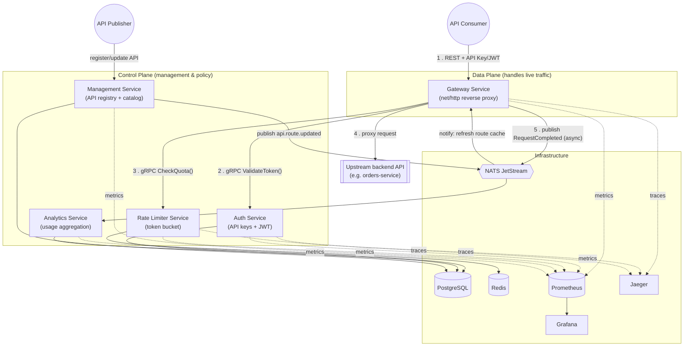
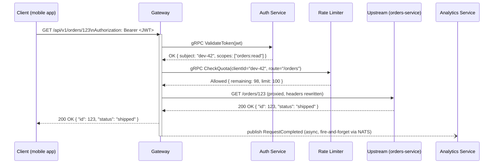
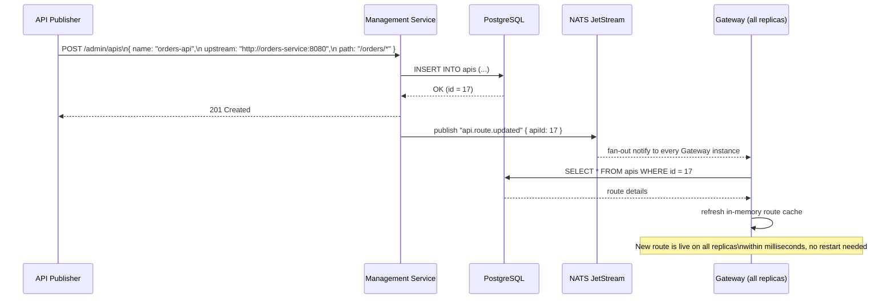
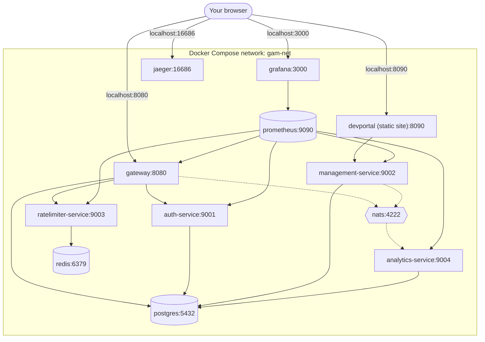

# Go API Manager (GAM)

> A lightweight, self-hosted API gateway and management platform, built in Go as a set of independent microservices — routing, authentication, rate limiting, analytics, and API publishing for your backend services.

**Status:** Architecture finalized (see [roadmap.md](roadmap.md) for the build plan). Implementation is underway, service by service; this README reflects the target design and will be updated as each service lands.

---

## Table of Contents

- [What is an API Manager?](#what-is-an-api-manager)
- [Why this project](#why-this-project)
- [Feature scope](#feature-scope)
- [Architecture](#architecture)
  - [System context](#1-system-context)
  - [Components & data stores](#2-components--data-stores)
  - [Request flow: calling a published API](#3-request-flow-calling-a-published-api)
  - [Control flow: publishing a new API](#4-control-flow-publishing-a-new-api)
  - [Deployment view (Docker Compose)](#5-deployment-view-docker-compose)
- [Tech stack](#tech-stack)
- [Repository structure](#repository-structure)
- [Getting started](#getting-started)
- [Documentation index](#documentation-index)
- [Roadmap](#roadmap)
- [Stretch goals](#stretch-goals)

---

## What is an API Manager?

If you've ever used **Kong**, **Tyk**, **Apigee**, or **WSO2 API Manager** — this is the same category of system. In plain terms, an API Manager sits *between* people who call your APIs and the actual backend services that implement them, and gives you:

- **A single front door** for all your backend APIs (a *gateway*), so consumers don't need to know which of your 30 internal microservices actually handles their request.
- **Access control** — who is allowed to call what (API keys, OAuth2/JWT tokens).
- **Traffic control** — rate limiting/throttling so one noisy client can't take the system down.
- **Visibility** — analytics on who's calling what, how often, and how it's performing.
- **A publishing workflow** — a way for API owners to register/version/document an API, and for developers to discover and subscribe to it (a "developer portal").

GAM builds a scoped-down but architecturally real version of that system, as a set of independent Go microservices you run yourself.

## Why GAM

- **Own your API infrastructure** — no vendor lock-in and no black-box SaaS gateway. Every component is a plain Go service you can read, run, and modify.
- **Real service boundaries** — REST at the edge for consumers, gRPC internally between services, and async messaging (NATS) for anything that shouldn't block the request path.
- **Operability built in, not bolted on** — structured logging, Prometheus metrics, distributed tracing, and resilience patterns (timeouts, retries, circuit breakers) are part of the core design.
- **Small footprint** — a handful of Go binaries plus Docker Compose. No Kubernetes cluster required to run it.

See [roadmap.md](roadmap.md) for the full build plan and the reasoning behind every major technology choice.

## Feature scope

Core scope:

- ✅ API Gateway — dynamic reverse proxy/routing to registered upstream services
- ✅ Authentication — API keys + JWT, OAuth2 client-credentials flow (hand-rolled)
- ✅ Rate limiting / throttling — token-bucket quotas per client, per API
- ✅ Analytics — async request logging, aggregated usage/latency/error stats
- ✅ API publishing — admin API to register/update/remove APIs and routes
- ✅ Minimal developer portal — browse published APIs, self-register for a key
- ✅ Observability — structured logs, Prometheus metrics, Grafana dashboards, distributed tracing (Jaeger)
- ✅ Resilience — timeouts, retries, circuit breaking, graceful shutdown
- ✅ Docker Compose deployment, CI pipeline

Explicitly **not** in the core scope (see [Stretch goals](#stretch-goals)): Kubernetes, monetization/billing, multi-tenant orgs, GraphQL, API marketplace, a full login-UI OAuth2 flow, service mesh.

---

## Architecture

### 1. System context

Who/what talks to this system, at the highest level.



**Reading this diagram:** `Client` never talks to `orders-service` or `payments-service` directly — it only ever knows about the Gateway's public address. The upstream service names (`orders-service`, `payments-service`) are just illustrative example backends we'll stub out for testing; they represent "whatever real API you'd put behind this manager."

### 2. Components & data stores

The five services, their protocols, and the infrastructure they depend on.



**Why gRPC internally but REST externally?** External consumers expect plain JSON/REST — that's the API contract we're managing. But *between our own services*, we control both ends, so gRPC's speed, strict typed contracts (`.proto` files), and code generation are a better fit. This "REST north-south, gRPC east-west" split is a common real-world pattern and a good architecture talking point.

**Why does the Gateway subscribe to NATS instead of polling Postgres for route changes?** Polling every service on every request (or even every few seconds) either adds latency or database load at scale. Instead, the Management Service publishes an event *only when something actually changes*, and the Gateway keeps a fast in-memory cache that it refreshes on notification — a classic cache-invalidation-via-events pattern.

### 3. Request flow: calling a published API

A concrete walk-through of one real request, hop by hop.



**Note on the async step:** the Gateway does **not** wait for the Analytics publish to succeed before responding to the client — that would tie the client's latency to a downstream logging system's health. This is the whole point of using NATS here instead of a direct synchronous call.

### 4. Control flow: publishing a new API

How an admin registers a new upstream service, and how running Gateway instances find out about it without a restart.



### 5. Deployment view (Docker Compose)

How this all runs locally as one `docker compose up`.



---

## Tech stack

| Concern | Choice | Notes |
|---|---|---|
| Language | Go (1.22+) | Standard toolchain, no framework magic. |
| HTTP routing | `net/http` + [`chi`](https://github.com/go-chi/chi) | Thin router, no hidden magic. |
| Internal RPC | gRPC + Protocol Buffers | Gateway ↔ Auth, Gateway ↔ Rate Limiter. |
| Database | PostgreSQL via `sqlx` | Raw SQL, no ORM. |
| Cache / counters | Redis (`go-redis`) | Token-bucket rate limiting, route cache. |
| Async messaging | NATS JetStream | Request-completed events, route-change notifications. |
| Auth | JWT (`golang-jwt`) + hashed API keys (bcrypt) | Hand-rolled OAuth2 client-credentials flow. |
| Logging | `log/slog` (stdlib) | Structured JSON logs. |
| Metrics | Prometheus (`client_golang`) + Grafana | Request rate, latency, error rate, quota rejections. |
| Tracing | OpenTelemetry + Jaeger | Cross-service trace propagation over HTTP & gRPC. |
| Containers | Docker (multi-stage builds) + Docker Compose | Kubernetes is a stretch goal, not core scope. |
| CI | GitHub Actions | Lint (`golangci-lint`), test, build. |
| Dev Portal | Static HTML/JS | Deliberately minimal — this is a backend-focused project. |

## Repository structure

```
go-api-manager/
├── README.md                 # you are here
├── roadmap.md                # phase-by-phase build plan
├── go.work                   # ties all service modules together for local dev
├── docs/                     # architecture decisions and design notes, one per subsystem
│   ├── adr-001-service-boundaries.md
│   ├── adr-002-auth-service.md
│   └── ...
├── services/
│   ├── gateway/               # data plane: reverse proxy, routing
│   ├── auth/                  # API key + JWT issuance/validation
│   ├── management/            # control plane: API registry + catalog
│   ├── ratelimiter/           # token-bucket quota service (gRPC)
│   └── analytics/             # NATS consumer + usage query API
├── pkg/                       # shared library code (logger, config, middleware, errors)
├── proto/                     # .proto contracts for internal gRPC services
├── deployments/
│   └── docker/                # Dockerfiles, docker-compose.yml, Prometheus/Grafana config
├── devportal/                 # static HTML/JS developer portal
└── scripts/                   # DB migrations, seed data, load test scripts
```

*(This structure is created incrementally, service by service, per the roadmap — it doesn't exist yet.)*

## Getting started

Not yet runnable. Services are being implemented one at a time per the [roadmap](roadmap.md); once the first services land, this section will cover setup and running the stack with `docker compose up`.

## Documentation index

Populated as each service lands. See [roadmap.md](roadmap.md) for the full build plan and what each stage covers.

## Roadmap

The full build plan — including every architecture trade-off and why it was made — lives in **[roadmap.md](roadmap.md)**.

## Stretch goals

Only attempted once the core scope above is complete (see [roadmap.md](roadmap.md#stretch-goals-only-if-time-remains--do-not-let-these-threaten-week-3)):

- Kubernetes deployment (kind/minikube + Helm + HPA)
- Full OAuth2 Authorization Code flow with a real login page
- API monetization / usage-based billing
- Multi-tenant organizations
- GraphQL or gRPC-Web gateway for external clients
- Canary / blue-green routing at the Gateway
